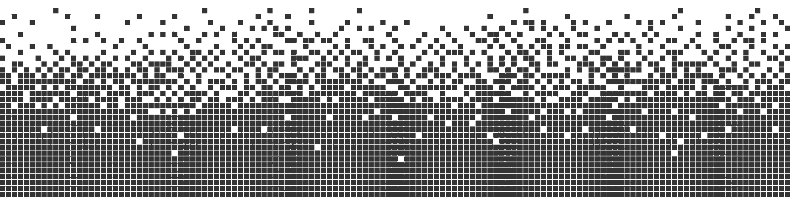

# Emanuel Hofer

**`Game Dev.`**

Hi there! I'm a passionate programmer who loves creating games and exploring the world of software development. While I'm still learning a lot, I've already created several game prototypes and I'm excited to continue developing my skills as a self-thaught game developer.

One of my main focuses in programming is optimization and creating reusable code that can be used across different systems. I believe that efficient code is not only more satisfying to write, but also leads to better performance and more polished products.

  
## personal-tools:

 

## work-tools:

  

  <!-- Dark Mode -->
  
 
    
    
  

  <!-- Light Mode -->
  
 
    
    
  

 

